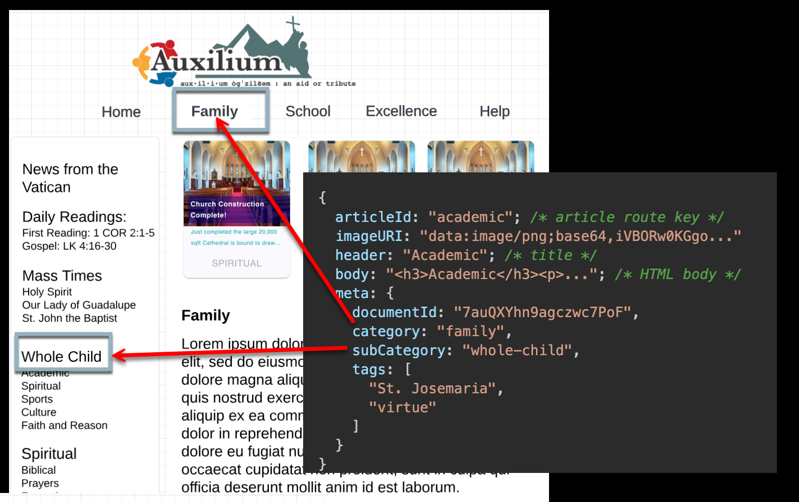

# Article 

```javascript
{
  articleId: "academic"; /* article route key */
  imageURI: "data:image/png;base64,iVBORw0KGgo..."
  header: "Academic"; /* title */
  body: "<h3>Academic</h3><p>..."; /* HTML body */
  meta: {
    documentId: "7auQXYhn9agczwc7PoF",
    category: "family",
    subCategory: "whole-child",
    tags: [
      "St. Josemaria", 
      "virtue"
    ]
  }
}
```


[Article](./src/app/interfaces/article.ts)
